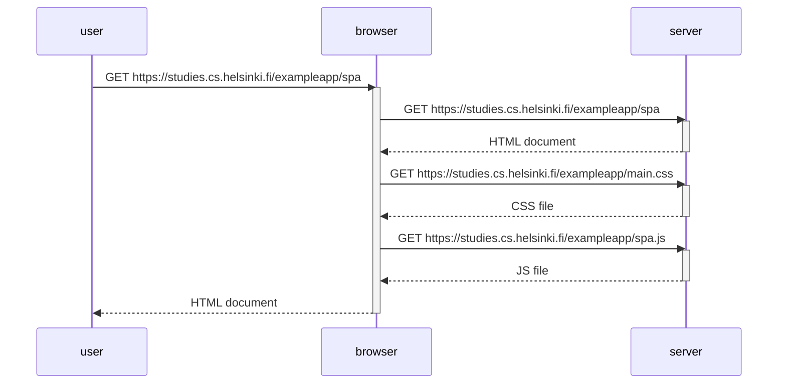

# Exercise 6

```mermaid
sequenceDiagram
    participant user
    participant browser
    participant server

    user->>browser: GET https://studies.cs.helsinki.fi/exampleapp/spa
    activate browser

    browser->>server: GET https://studies.cs.helsinki.fi/exampleapp/spa
    activate server
    server-->>browser: HTML document
    deactivate server

    browser->>server: GET https://studies.cs.helsinki.fi/exampleapp/main.css
    activate server
    server-->>browser: CSS file
    deactivate server

    browser->>server: GET https://studies.cs.helsinki.fi/exampleapp/spa.js
    activate server
    server-->>browser: JS file
    deactivate server
    
    browser-->>user: HTML document
    deactivate browser
```
