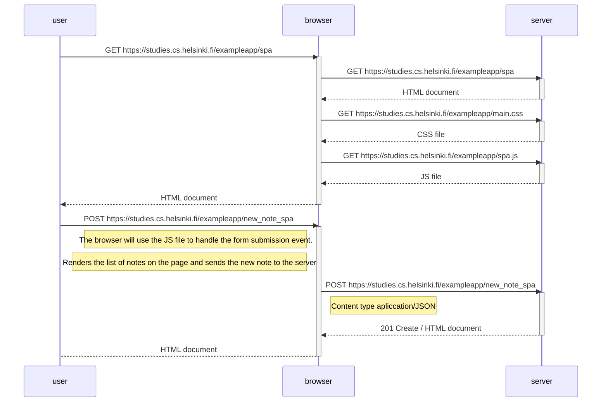

# Exercise 6

```mermaid
sequenceDiagram
    participant user
    participant browser
    participant server

    user->>browser: GET https://studies.cs.helsinki.fi/exampleapp/spa
    activate browser

    browser->>server: GET https://studies.cs.helsinki.fi/exampleapp/spa
    activate server
    server-->>browser: HTML document
    deactivate server

    browser->>server: GET https://studies.cs.helsinki.fi/exampleapp/main.css
    activate server
    server-->>browser: CSS file
    deactivate server

    browser->>server: GET https://studies.cs.helsinki.fi/exampleapp/spa.js
    activate server
    server-->>browser: JS file
    deactivate server
    
    browser-->>user: HTML document
    deactivate browser

    user->>browser: POST https://studies.cs.helsinki.fi/exampleapp/new_note_spa
    
    activate browser
    Note left of browser: The browser will use the JS file to handle the form submission event.
    Note left of browser: Renders the list of notes on the page and sends the new note to the server
    
    browser->>server: POST https://studies.cs.helsinki.fi/exampleapp/new_note_spa
    activate server
    
    Note right of browser: Content type apliccation/JSON
    
    server-->>browser: 201 Create / HTML document
    deactivate server

    browser-->user: HTML document
    deactivate browser
```
